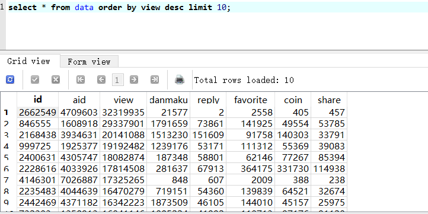
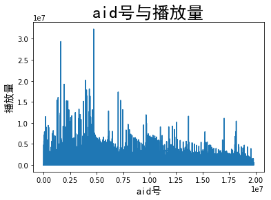

# B站视频信息(av号，播放量，弹幕数，硬币数，分享量，评论数，收藏数)爬虫


数据结果在最下面。</br>

## 准备工作

我使用的是Python3，数据库用的是Python自带的sqlite，使用requests库爬取。</br>
安装需要的库</br>

```python
pip install requests
```

直接刷新视频页面来获取视频信息太慢，通过api地址能快速获取视频信息。</br>
如：https://api.bilibili.com/x/web-interface/archive/stat?aid=19801429，</br>
在浏览器中打开这个页面，可以获取json格式的数据：</br>
```javascript
{
  "code":0,
  "message":"0",
  "ttl":1,
  "data":{
    "aid":19801429,
    "view":583,
    "danmaku":4,
    "reply":2,
    "favorite":378,
    "coin":6,
    "share":6,
    "now_rank":0,
    "his_rank":0,
    "no_reprint":0,
    "copyright":2}
}
```
使用requests库获取数据，用concurrent.futures的多线程来加快爬取的速度，我采用的是32线程爬取。</br>

## 数据获取
B站对爬虫采取的是一旦发现，就封ip半小时到1天不等的时间。</br>
但是如果使用代理，爬取总共数量1900万(在2018年2月24，B站视频av号已经到2000万了)个视频信息需要花费很多时间。</br>
幸运的我发现我的服务器爬取B站视频信息不会被封ip，于是我就把爬虫放到服务器上跑了整整5天，获得了1300万条有效数据。数据库文件有300M，GitHub无法上传，</br>
我放到了百度云里：https://pan.baidu.com/s/1ggxaanL ，密码: i8mb。</br>

## 数据处理
我使用的是SQLiteStudio进行数据库操作</br>
### 查询播放量前十的视频
</br>
### 查询收藏数前十的视频
</br>
### aid号与播放量关系
可以从下图看出，随aid号的增加，视频的平均播放量在变少，爆款视频也在变少。</br>
我认为主要原因是B站UP主变多，把许多大的UP主的粉丝分流了部分。</br>
画图代码见 [aid号与播放量关系.py](code/aid号与播放量关系.py)</br>
</br>
### 收藏数与硬币数关系
画图代码见 [收藏数与硬币数关系.py](code/收藏数与硬币数关系.py)</br>
</br>
爬虫代码见 [bilibili-spider.py](bilibili-spider.py)</br>
参考代码： [bili-spider](https://github.com/chenjiandongx/bili-spider)</br>